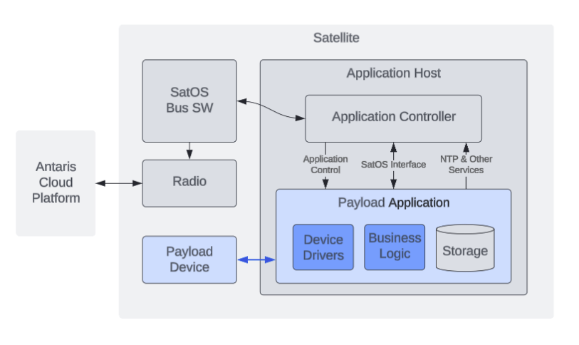

SatOS Payload Developer Guide
#############################

The SatOS Payload SDK provides libraries, tools and documentation that support developing satellite payloads for use with SatOS (TM) from Antaris, Inc.
This enables effective development and testing of payload applications, which handle communication with core spacecraft services as well as payload-specific devices.

Using the Payload SDK
*********************

Developers should use this guide as a primary resource while developing a payload.
Furthermore, SDK libraries and tools here MUST be adopted to develop a well-formed payload.

As a starting point, one should consult the ACP User Guide (available through ACP Support Portal) and experiment with a demo payload application: https://github.com/antaris-inc/SatOS-Payload-Demos.
The demo apps should be used as a starting point for any new Payload Application.

Glossary
********

**Payload**: an entity operating onboard a satellite, directly supporting mission objectives.

**Antaris Cloud Platform (ACP)**: the cloud-based SaaS platform developed and operated by Antaris. ACP is used to drive development, simulation and operation of satellites.

**Payload Developer**: an individual working with the Antaris Cloud Platform to develop, deploy and operate a payload.

**Payload SDK**: toolkit containing source code libraries and documentation used by Payload Developers to effectively develop a payload.

**Payload Application (PA)**: software developed by a Payload Developer using the Payload SDK which operates its Payload Device, interacts with PC for flight services and executes payload mission business logic.

**Payload Sequence**: a discrete operation implemented by a PA to execute mission objectives. Payload Sequences are triggered via Telecommands through ACP.

**Telecommand**: an imperative command sent from an operator to a satellite representing a logical action to be taken. Examples include "point towards the ground", "establish X-band radio connection", and "execute XYZ payload sequence". Telecommands may be executed on-demand during a ground contact, or they may be scheduled for execution over time. Typically, Telecommands are executed via higher-level abstractions such as Tasks.

**Payload Server**: the physical onboard system with CPU, memory, storage and I/O connectivity for Payload Devices. It hosts Payload Applications and various system services.

**Payload Controller (PC)**: control software that manages operations on the Payload Server and acts as a gateway to all services provided to Payload Applications.

**Payload Interface**: API enabling bidirectional communication between Payload Applications and the Payload Controller.

**Payload Device**: a physical device provided by a Payload Developer that is physically connected to the Payload Server via one of the designated interfaces (Ethernet, I2C, UART, USB, SPI, etc).

**Device Driver**: a general term used to describe any software supporting direct access to or manipulation of a Payload Device. A driver typically supports one or both of the following:

  * **General Device I/O**: having generic knowledge about mechanisms to communicate with hardware entities using a particular interface type (e.g. USB, UART etc.), or
  * **Device-specific capabilities**: having knowledge of the Payload Device specifics and exposing abstracted interfaces for higher level software, while encapsulating the device details

System Architecture
*******************

A developer is responsible for a Payload Application and a Payload Device – effectively everything highlighted in blue below:

Payload Applications contain payload-specific business logic and any device drivers necessary to interact with a Payload Device. Storage is made available to the application that persists across reboots or unexpected failures.

While active, a Payload Application has full control over its associated device and may interact with the Spacecraft Controller via the Payload Controller and the Payload Interface. This allows Payload Applications to coordinate with the onboard scheduler, emit telemetry/teledata for downlink, implement health checking, etc.

The Spacecraft Controller manages all communication with ACP, typically via radio communication with ground stations. This is the control and data path for onboard payloads.

Application Design
******************

A Payload Application encompasses all software operating within the Payload Server for a single payload, including all necessary application-specific software and system libraries. Payload Applications are packaged as container images, and the environment within which the containers are executed is orchestrated by the Payload Controller.

This section of the SDK guide explains how a developer should think about design and implementation of a Payload Application.

Application Operation
=====================

When a Payload Application is scheduled to be active for a given period of time, a simple state machine is executed:

1. Payload Device is powered on
2. Payload Application is booted up
3. Payload Application starts via developer-provided entrypoint script
4. Payload Application initializes a Payload Interface connection (typically using an appropriate SDK library)
5. Payload Controller instructs Payload Application to execute required Payload Sequences
6. Payload Application acknowledges when sequences are complete
7. Payload Controller stops application, with time allowed for graceful shutdown
8. Payload Device is powered off

Payload Sequences
=================

A Payload Sequence represents a discrete unit of work, and usually maps to specific manipulation of a payload device in accordance with mission objectives.

Payload Sequences are scheduled using simple heuristics, all controlled by the Antaris Cloud Platform. Examples of this include "when the satellite is within range of X,Y coordinates" or "twice per orbit during the local day time". Any geographic triggers (ground target pointing, enter/leave bounding box, etc.) are resolved within ACP before Payload Sequences are executed.

Payload Applications are instructed to execute Payload Sequences using the Payload Interface. Payload Applications are not "always on", and will only be booted up when its sequences are to be executed. Sequences are always given a duration within which they are expected to run, and are not able to run forever.

Dynamic/on-demand interaction for active debugging and diagnosis is supported directly via ACP.

File Upload & Download
======================

File uploads are facilitated by ACP. Uploaded files are made available at a pre-determined location in a Payload Application’s storage space. Keep in mind that radio uplink bandwidth is typically limited, so it is wise to minimize upload file size and to consider piecemeal update processes.

File downloads are typically initiated in response to creation of some mission-oriented data by the Payload Application and/or Payload Device. A PA must inform the satellite that files are ready to be downloaded using the Payload Interface. After notification, files can then be automatically downlinked to the ground and distributed to mission operators.

Application Modes
=================

On boot, the Payload Application has an opportunity to determine the "mode" of operation requested. This is used to instruct the Payload Application to start up in one or more states to facilitate actions such as upgrading application software or implementing a "factory reset" to recover from some failure. Mode handling is typically implemented via SDK libraries.

Application Upgrades
====================

Payload Applications are expected to upgrade themselves, typically using package-based processes (i.e. deb/rpm).

An alternate PA mode should be used to trigger an upgrade. This explicit approach is preferred as it allows for upgrade/recovery in the event the PA is unable to operate normally.

A typical upgrade flow would look like so:

1. Operator uses ACP to uplink needed files to PA storage
2. An upgrade task is sceduled via ACP, which results in a PA booting up in an ``upgrade`` mode
3. The PA entrypoint detects the alternate mode of operation and applies any software/filesystem changes necessary, then shuts down normally
4. Subsequent tasks then boot the PA into a nominal mode and resume normal operations.

If an upgrade needs to be applied to the entrypoint script itself, out-of-band update processes can also be applied.

Application Environment
***********************

This section describes the runtime compute environment a PA will operaet within.

Configuration
=============

Application configuration is provided via the readonly ``/opt/antaris/app/`` directory. These files include:

* **config.json** contains a JSON-encoded config file, constructed by the PC to help automate PA configuration
* **mode** contains the current application mode. This file is typically read by the PA entrypoint script to influence PA startup behavior

Both of these files are managed by the system and are readonly to the running application processes.

Compute & Storage
=================

All Payload Applications are deployed as virtual machines. CPU and memory resources are configured within the Antaris Cloud Platform during satellite configuration. Storage capacity is also pre-configured.

All storage is persistent and will maintain state across reboots. Access to storage is provided via the following filesystem mounts:

* ``/opt/antaris/outbound/``: contains files produced by the PA that are intended for downlink during a ground station contact
* ``/opt/antaris/inbound/``: contains files uplinked and made available to the PA. The PA has readonly access of this folder.
* ``/opt/antaris/workspace/``: available to be used as a scratch space or sandbox, supporting active operation of a PA. The PA has full read/write permissions.

Network
=======

Each Payload Application receives a unique IP Address, as do any associated Payload Devices. The Payload Controller and an NTP server are also available over this network. The values assigned to these resources are defined in the PA config file, and should be accessed via the SDK library.

Device Access
=============

All necessary devices are exposed to the payload application natively.
Filesystem locations and device identifiers are provided by the application config (see `Configuration` above).

Payload SDK library support is available to assist in reading device configuration from the config.
Additional library support is also available to simplify GPIO I/O.

Packaging
=========

Developers work in a containerized environment during payload development. Base docker images are available via quay.io:

* Python-based applications: `quay.io/antaris-inc/satos-payload-app-python:stable`
* CPP-based applications: `quay.io/antaris-inc/satos-payload-app-cpp:stable`

Examples usage of these images are available: https://github.com/antaris-inc/SatOS-Payload-Demos.

Integration of applications into SatOS for on-orbit operation as virtual machines is not addressed in this guide.

Payload Tasks & Schedules
*************************

A **Task** represents a higher-level operation, such as spacecraft station-keeping or payload manipulation. Tasks take the form of templates containing ordered sets of Telecommands. For example, a Task might be defined to point to a location on the ground and manipulate an earth observation payload:

+---+----------------------+-------------------------------------------------------------+------+
| *Example Task "exec_payload_imager"* (Duration = D)                                           |
+---+----------------------+-------------------------------------------------------------+------+
| # | Telecommand          | Parameters                                                  | Time |
+===+======================+=============================================================+======+
| 1 | adcs_point_nadir     |                                                             | T    |
+---+----------------------+-------------------------------------------------------------+------+
| 2 | power_on_payload     | Payload_HW_ID=7                                             | T1   |
+---+----------------------+-------------------------------------------------------------+------+
| 3 | boot_payload_app     | Payload_APP_ID=4, Mode=primary                              | T2   |
+---+----------------------+-------------------------------------------------------------+------+
| 4 | start_sequence       | Payload_APP_ID=4, Seq_ID=”B”, Seq_Params=“arg1”, Dur=D      | T3   |
+---+----------------------+-------------------------------------------------------------+------+
| 5 | shutdown_payload_app | Payload_APP_ID=4                                            | T3+D |
+---+----------------------+-------------------------------------------------------------+------+

An **Operator** uses Tasks to construct a **Schedule**. Schedules contain a series of Telecommands rendered from input Tasks. A schedule typically spans one or more days, beginning some number of hours or days in the future. This is used to instruct a satellite how to autonomously operate while outside of an active ground station contact.

An example Schedule could be created from the following tasks, taking the provided Start Time and Duration as input:

+---+------------------------+------------+----------+
| # | Task                   | Start Time | Duration |
+===+========================+============+==========+
| 1 | execute_payload_imager | 02:00:00   | 1200     |
+---+------------------------+------------+----------+
| 2 | ground_contact_alaska  | 02:24:40   | 600      |
+---+------------------------+------------+----------+

The rendered Schedule might look like so:

+---+----------------------+-------------------------------------------------------------+----------+
| # | Telecommand          | Parameters                                                  | Time     |
+===+======================+=============================================================+==========+
| **execute_payload_imager(D=1200)**                                                                |
+---+----------------------+-------------------------------------------------------------+----------+
| 1 | adcs_point_nadir     |                                                             | 02:00:00 |
+---+----------------------+-------------------------------------------------------------+----------+
| 2 | power_on_payload     | Payload_HW_ID=7                                             | 02:02:30 |
+---+----------------------+-------------------------------------------------------------+----------+
| 3 | boot_payload_app     | Payload_APP_ID=4, Mode=primary                              | 02:04:00 |
+---+----------------------+-------------------------------------------------------------+----------+
| 4 | start_sequence       | Payload_APP_ID=4, Seq_ID=”B”, Seq_Params=“arg1”, Dur=1200   | 02:04:30 |
+---+----------------------+-------------------------------------------------------------+----------+
| 5 | shutdown_payload_app | Payload_APP_ID=4                                            | 02:24:30 |
+---+----------------------+-------------------------------------------------------------+----------+
| **ground_contact_alaska(D=600)**                                                                  |
+---+----------------------+-------------------------------------------------------------+----------+
| 6 | adcs_point_lat_lng   | lat_lng=61,-147                                             | 02:24:40 |
+---+----------------------+-------------------------------------------------------------+----------+
| 7 | exec_ground_contact  | bands=s,x                                                   | 02:26:00 |
+---+----------------------+-------------------------------------------------------------+----------+

Task definition and scheduling is a collaborative, ongoing exercise. During initial payload development, it is helpful to keep the following dimensions in mind:

* **Task ID**: an alphanumeric value assigned by payload developer (e.g. "execute_payload_imager" above)
* **Task Duration**: the amount of time required to run the Task
* **Trigger Conditions**: the geographic location, absolute/relative time that Tasks should be executed
* **Executions per Orbit/Day**: the number of times a Task should be invoked within a given time period, likely per orbit or per 24-hour period
* **Payload Device Power State**: the expected payload device power state before and during Task execution
* **Power Requirements**: the average and max power requirements required for the Task

Using the Payload SDK Libraries
*******************************

The SDK provides the following programming language support:

* Python: see the :doc:`python-application-guide` for more information.

* For CPP-based applications: a debian package named `satos-payload-sdk-cpp` containing CPP Payload Interface client support. This is distributed within the CPP base docker image.

Sample payload applications demonstrating usage of these libraries are available here: https://github.com/antaris-inc/SatOS-Payload-Demos.
