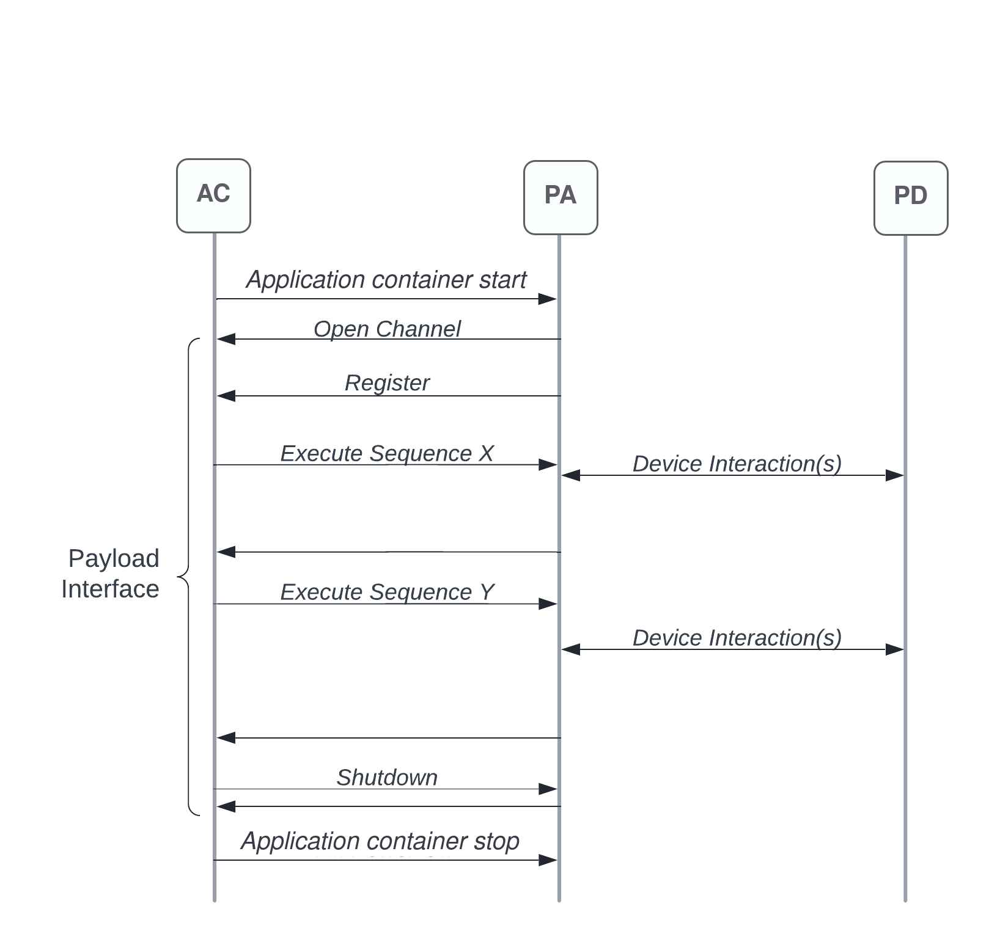

SatOS Interface Reference
#########################

This reference document describes how to work with the SatOS Interface, from a conceptual level down to actual API requests and responses.

Introduction
************

The SatOS Interface is a bidirectional communication mechanism utilized by the Application Controller and a Payload Application. A “channel” below represents an open connection between a single PA and the AC.

The SatOS Interface relies on an asynchronous request/response model. A “correlation ID” is used to map responses back to the originating requests when async responses are to be expected. The Application Controller also works with this asynchronous model, expecting async responses from the Payload Application to its own requests.

Though the API schema and data structures defined in this document are in syntax of programming language C, the SDK library is available in multiple languages.

Request Flow Example
********************

The following flow diagram represents how the SatOS Interface is used during a typical period of payload operation:

Encryption & Authentication
***************************
Communication between a Payload Application and the Application Controller is encrypted. All messages between the PA and AC are encrypted. This encryption feature is built into available SDK software libraries, and should be left enabled at all times.

Authentication of communication via the SatOS Interface is achieved with a simple auth token retrieved during the PA registration call. This detail is handled by the SDK software libraries made available to payload developers, and no explicit action needs to be taken.

Establishing a Connection
*************************
To begin communication via the SatOS Interface, PA creates a connection to the Application Controller via the *CreateChannel* API. With the *CreateInsecureChannel* API, communication between PA and AC will not be encrypted. Once a channel is created, it is used to facilitate all other API calls.

To explicitly close the channel, a PA may use the *DeleteChannel* API. This is not required, but highly encouraged as it helps the AC understand the current state of the PA. 

Connection/channel management is typically abstracted by an SDK library, and developesr should not need to worry about explicit create/delete.

API Reference
*************

Payload Application Requests
============================

Below are the interactions that may be initiated by a Payload Application. Note that most requests define a corresponding asynchronous response, but some do not.

Register
^^^^^^^^

Register the PA with the AC, typically executed immediately after opening a channel. The AC will only communicate with PAs that successfully register themselves. After some time without registration, a PA will be considered in a bad state and may be shut down prematurely.

Parameters:

* ``U16 CorrelationId``
* ``U16 HealthCheckFailAction``

  * Indicates what the AC should do if the application fails to respond to health checks five consecutive times. A ``0`` value results in no action taken, while ``1`` indicates the application should be rebooted. 

Expected async response from AC: ``ResponseRegister``

* ``U16 CorrelationId``

  * Will match what was sent in ``Register`` request

* ``U16 ReqStatus``

  * ``0`` if request succeeded, otherwise non-zero value indicating failure 

* ``[256]U8 AuthToken``

GetCurrentLocation
^^^^^^^^^^^^^^^^^^

Retrieve current GNSS (GPS) location.

Parameters:

* ``U16 CorrelationId``

Expected async response from AC: ``ResponseGetCurrentLocation``

* ``U16 CorrelationId``

  * Will match what was sent in request

* ``U16 ReqStatus``

  * ``0`` if request succeeded, otherwise non-zero value indicating failure 

* ``DOUBLE Latitude``
* ``DOUBLE Longitude``
* ``DOUBLE Altitude``
* ``FLOAT SD_Latitude``
* ``FLOAT SD_Longitude``
* ``FLOAT SD_Altitude``
* ``U64 DeterminedAt``

  * Time at which the location was determined 

PayloadPowerControl
^^^^^^^^^^^^^^^^^^^

Request to change the power state of any specific Payload Device. PA can power cycle its device by issuing a Power-Off request followed by a Power-On after some delay.

Parameters:

* ``U16 CorrelationId``
* ``U16 PowerOperation``
* ``U16 hwid``

  * Request Power-Off with a value of ``0``, or Power-On with a value of ``1``
  * ``U16 hw_id`` 

    * the Id of the payload device which needs to Power-On or Power-Off

Expected async response from AC: ``ResponsePayloadPowerControl``

* ``U16 CorrelationId``

  * Will match what was sent in request

* ``U16 ReqStatus``

  * ``0`` if request succeeded, otherwise non-zero value indicating failure 

StageFileDownload
^^^^^^^^^^^^^^^^^

Indicate that a file is ready to be download through a ground link. The Payload Application is expected to first place the file in ``/opt/antaris/outbound`` before making this API call. The Application Controller will delete this file from the outbound folder once it is successfully downlinked.

Parameters:

* ``U16 CorrelationId``
* ``char[64] FileLocation``
  
  * Relative path within ``/opt/antaris/outbound``. For example, to stage a file located at ``/opt/antaris/outbound/foo/bar.json``, one would set ``FileLocation=foo/bar.json``

Expected async response from AC: ``ResponseStageFileDownload``

* ``U16 CorrelationId``

  * Will match what was sent in request

* ``U16 ReqStatus``

  * ``0`` if request succeeded, otherwise non-zero value indicating failure. Success here does NOT mean the file has been downlinked. It simply represents the downlink request has been accepted, and the file will be downlinked at a later time.

GetGnssEphData
^^^^^^^^^^^^^^

Request to get GNSS EPH1/EPH2 data periodically or one-time. Callback is received to application based on time period set.

Parameters:

* ``U16 CorrelationId``
* ``U8  Enable_EPH2``

  * Request Enable_Eph2 with a value of ``1``, or disable with value of ``0`` 
* ``U32 Periodicity_in_MS``

  * Set it to ``0`` if onetime GNSS EPS data needed, or set with expected periodicty in milliseconds

Expected periodic callback from AC: ``ResponseGnssEphData``

* ``U16 CorrelationId``

  * Will match what was sent in request

* ``U64 GPS_Fix_Time``   
                
  * GPS time
      
* ``U64 GPS_Sys_Time``               
    
  * GPS System time
        
* ``U64 OBC_Time``                   
    	
	* OBC time
        
* ``U64 GPS_Position_ECEF[3]``       
    
	* GPS position
   
* ``U64 GPS_Velocity_ECEF[3]``       
    
	* GPS velocity
    
* ``U16 GPS_Validity_flag_pos_vel``  
    
	* GPS validity flag
    
* ``U64 ADCS_Time``            
    
	* Orbit time
    
* ``U64 Position_WRT_ECI[3]``        
    
	* Position
    
* ``U64 Velocity_wrt_ECI[3]``        
    
	* Position
    
* ``U64 Position_wrt_ECEF[3]``       
    
	* Position
    
* ``U64 Velocity_wrt_ECEF[3]``       
    
	* Position
    
* ``U32 Body_Rate[3]``               
    
	* Body rate
    
* ``U32 Attitude[3]``                
    
	* RPY WRT LVLH
    
* ``U32 ADCS_POS[3]``                
    
	* Lat, Lon, Altitude (ADCS)
    
* ``U32 Nadir_Vector_Body[3]``       
    
	* Nadir vector
    
* ``U32 GD_Nadir_Vector_Body[3]``    
    
	* GD Nadir Vector Body
    
* ``U32 Beta_Angle``                 
    
	* Beta Angle
    
* ``U16 Validity_Flags``             
    
 	* ``1-bit flags`` : Time Validity,
    			            Position and Velocity ECI Validity, 
                      Position and Velocity ECEF Validity, 
                      Rate Validity, 
                      Attitude Validity,
                      Lat-Lon-Altitude Validity,
                      Nadir Vector Validity,
                      GD Nadir Vector Validity,
                      Beta Angle Validity

GetEpsVoltage
^^^^^^^^^^^^^

Request to get EPS voltage data periodically or one-time. Callback is received to application based on time period set.

Parameters:

* ``U16 CorrelationId``
* ``U32 Periodicity_in_MS``

  * Set it to ``0`` if onetime EPS voltage info needed, or set with expected periodicty in milliseconds

Expected periodic callback from AC: ``ResponseEpsVoltage``

* ``U16 CorrelationId``

  * Will match what was sent in request

* ``FLOAT EPS_Voltage``   
                
  * EPS instanteneous voltage

SesThermMgmntReq
^^^^^^^^^^^^^

Request SatOS to monitor temperature of hardware in every ``n ms (duration)``. Callback is received to SatOS_SDK if temperature of hardware is not in the range of lower and upper thresholds .

Parameters:

* ``U16 CorrelationId``
* ``U8 hardware_id``

  * Id of hardware which needs to be monitor

* ``U32 duration``

  * it monitor the hardware temperature in every given duration.

* ``U8 lower_threshold``
  
  * value of lower threshold, will recieve callback if temperature goes below this value.

* ``U8 upper_threshold``
  
  * value of upper threshold, will recieve callback if temperature goes above this value.

Expected periodic callback from AC: ``SesThrmlNtf``

* ``U16 CorrelationId``

  * Will match what was sent in request

* ``U8 heater_pwr_status``   
                
  * status of heater 0:OFF, 1:ON

* ``U8 temp``   
                
  * temperature of hardware in celsius

SesTempReq
^^^^^^^^^^^^^

Request temperature of hardware and power state of heater .

Parameters:

* ``U16 CorrelationId``
* ``U8 hardware_id``

  * Id of hardware

Expected callback from AC: ``RespSesTempReq``

* ``U16 CorrelationId``

  * Will match what was sent in request

* ``U8 temp``   
                
  * temperature of hardware in celsius

* ``U8 hardware id``   
                
  * Id of hardware

* ``U8 heater_pwr_status``   
                
  * status of heater 0:OFF, 1:ON

PaSatosMessage
^^^^^^^^^^^^^

Data that has to be sent to the SatOS.

Parameters:

* ``U16 CorrelationId``
* ``U16 Command``
      * Command is payload specific and it is understanding between SatOS_SDK and SatOS.

* ``INT[255] payload data``

  * payload data is a command parameter that has to be sent to the SatOS. it can be upto to 1020 bytes.
    

Expected callback from AC: ``RespPaSatOsMsg``

* ``U16 CorrelationId``

  * Will match what was sent in request

* ``U16 Command Id``   
                
  * Will match what was sent in request

* ``U16 ReqStatus``

  * ``0`` if request succeeded, otherwise non-zero value indicating failure 

FcmOperation
^^^^^^^^^^^^^

Request to start File copy from peer to host.

Parameters:

* ``U16 CorrelationId``

* ``U8 Dest``
      * Id of peer from which files are copied.

* ``U8 Src``
      * Id of peer to which files are copied.

* ``U8 peer app id``
      * Id of peer application from which files are copied.

* ``U8 no of files``
      * no of files to be copied. set it to 0 if all files needed to copy.

* ``Struct File Input[32]``

  * INT8 File name length
        * Length of file name
  * INT8 Filename[128]
        * File name    

Expected per file callback from AC: ``RespFcmOperation``

* ``U16 CorrelationId``

  * Will match what was sent in request

* ``U8 Req status``   
                
  * Success/failure of file copy

* ``U8 Fcm complete``

  * ``0`` if all files are processed, otherwise operation is still ongoing.

* ``INT8 File name[16]``

  * name of processed file.

Application Controller Requests
===============================

Below are the interactions that may be initiated by the Application Controller. Responses, when appropriate, are sent from the Payload Application.

StartSequence
^^^^^^^^^^^^^

AC sends this command to the PA to instruct it to execute a known sequence immediately.

Parameters:

* ``U16 CorrelationId``
* ``char[16] SequenceName``

  * An alphanumeric string that should be mapped and/or parsed by the Payload Application

* ``char[64] SequenceParams``

  * An alphanumeric string that should be mapped and/or parsed by the Payload Application

* ``U64 ScheduledDeadline``

  * Absolute unix time at which the PA must must have completed the sequence

Expected async response from PA: ``SequenceDone``

* ``U16 CorrelationId``

  * Must match what was sent in request

Shutdown
^^^^^^^^

Initiate a PA shutdown immediately. Application can shutdown its payload hardware gracefully before shutting itself down. PA will have a graceful shutdown deadline, the length of which is pre-configured in the Antaris Cloud Platform tasks.

Parameters:

* ``U16 CorrelationId``
* ``U64 ShutdownDeadline``

  * Absolute unix time at which the PA must must have issued a response and shut down gracefully, otherwise more aggressive shutdown procedures may be taken

Expected async response from PA: ``ResponseShutdown``

* ``U16 CorrelationId``

  * Must match what was sent in request

* ``U16 ReqStatus``

  * ``0`` if request succeeded, otherwise non-zero value indicating failure 

HealthCheck
^^^^^^^^^^^

AC monitors PA health by calling this request periodically (every 5 seconds). The PA should be prepared to process this request and report an accurate representation of its health immediately

Parameters:

* ``U16 CorrelationId``

Expected async response from PA: ``ResponseHealthCheck``

* ``U16 AppState``

  * Indicate overall payload application health with ``0``, otherwise non-zero indicates the PA is in a bad state

* ``U16 ReqsToPCInErrCnt``

  * Number of requests from PA to AC that failed

* ``U16 RespsToPCInErrCnt``

  * Number of responses from PA to AC that failed

PayloadMetrics
^^^^^^^^^^^^^^

PA maintains an array of eight `name-value`` pairs, called Metrics, containing payload-specific statistical information. The AC periodically requests these statistics by sending a request to the PA. The PA must be ready to process this request and respond immediately with accurate, up-to-date statistics.

Parameters:

* ``U16 CorrelationId``

Expected async response from PA: ``ResponsePayloadMatrics``

* ``U16 UsedCounter``

  * Indicate total number of metrics maintained by PA

* ``U64 TimeStamp``

  * Indicates current timestamp of response

* ``Struct PayloadMetricsInfo Matrics``

  * ``U8 name[256]``
    * Name of counter 
  * ``U32 counter``
    * Value 
